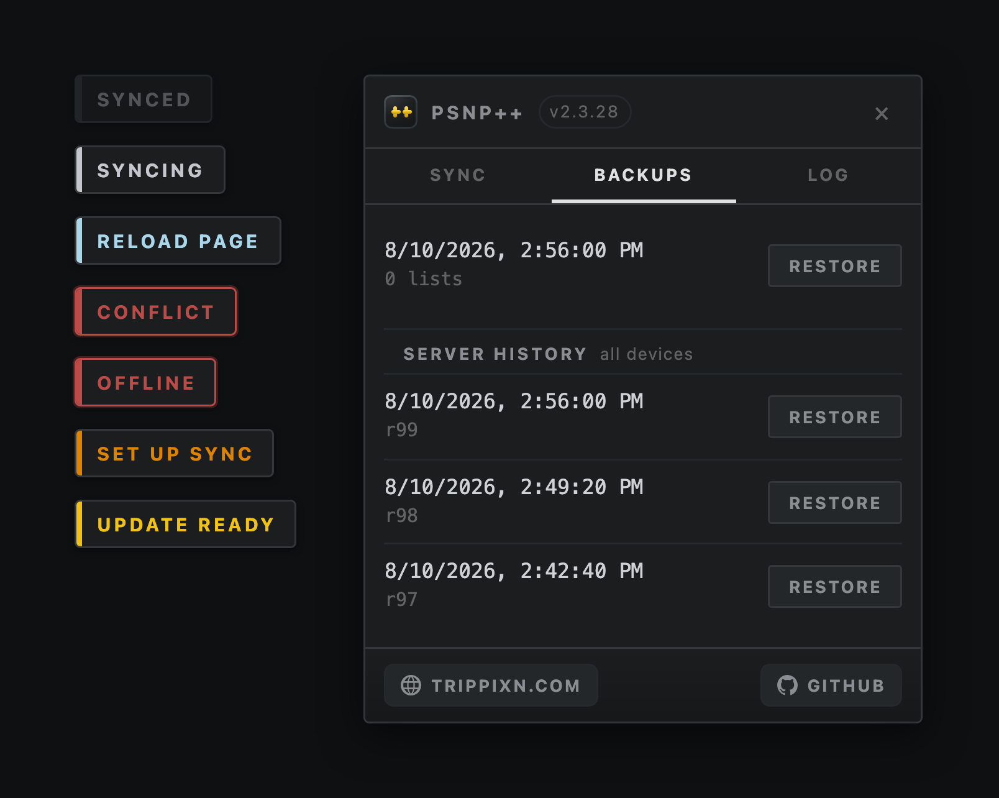

<div align="center">


# PSNP++

**Two-way sync for your [PSNP+](https://psnp-plus.huskycode.dev) game lists, across every device.**

[](https://github.com/trippixn963/PSNPPlusPlus/releases)
[](LICENSE)
[](https://www.tampermonkey.net)

</div>

---

PSNP+ keeps its game lists in `localStorage`, so a wishlist you build on the desktop simply
does not exist on the laptop. PSNP++ syncs them through a small service on your own server.

It is a **companion** to PSNP+, not a replacement. Install both, and PSNP+ keeps updating
itself from HusKyCode as normal.

<div align="center">

<br>
<sub>The status chip in each of its states, and the panel it opens — rendered from the real modules. <a href="#regenerating-the-icon-and-preview">Regenerate</a>.</sub>
</div>

Everything lives behind one chip in the corner of any psnprofiles.com page. It tells you the
sync state at a glance, left-click syncs, and right-click opens the panel: your sync key and
endpoint, and the last three daily backups with a one-click restore.

A backup is one snapshot of **all** your lists, taken once per day before the first merge that
writes — and always before any merge that would remove something, because that is the case a
cap must never ration. Restoring rewrites this browser and reloads the page. The server keeps
its own revision of every push behind that, which is what makes a second device recoverable.

> [!IMPORTANT]
> **No support.** This is published because the code may be useful to read, not because it
> is a product. Issues and pull requests are not monitored: no bug triage, no feature
> requests, no help getting it running, and no guarantee it keeps working or stays online.
>
> It is built for one person's setup and developed entirely to suit that. Breaking changes
> ship without notice or a migration path. If it is useful to you, **fork it** and run your
> own copy — that is the intended way to use this repository.

> [!WARNING]
> It writes to your saved lists. Read [How it touches PSNP+](#how-it-touches-psnp) and keep
> your own backups. MIT licensed, which means as-is and with no warranty.

## Install

> [!NOTE]
> This installs from the author's server and syncs against it, which needs a key you will
> not have. **To actually use PSNP++, [run your own](#running-your-own).**

Paste this into your browser and Tampermonkey will offer to install it:

```text
https://trippixn.com/psnppp.user.js
```

Install from the **URL**, not the file — that is what wires up auto-updates.

**PSNP+ must be installed and enabled first.** PSNP++ syncs the lists PSNP+ saves; on its
own it has nothing to sync. Get it from <https://psnp-plus.huskycode.dev>.

Then load any psnprofiles.com page, **right-click the status chip** in the corner, and paste
your sync key. Repeat on each device.

## Running your own

The sync service is a single FastAPI app over SQLite. It holds one document per key and does
not care what is in it.

**1. Deploy the service.** Put `sidecar/` behind a reverse proxy on a host you control — see
[the deploy guide](sidecar/deploy/DEPLOY.md).

**2. Repoint the userscript.** Three places, and all three matter:

| What | Where | Why |
|---|---|---|
| `DEFAULT_ENDPOINT` | [`userscript/src/config.mjs`](userscript/src/config.mjs) | The build-time default your users sync against |
| `@downloadURL` / `@updateURL` | [`userscript/banner.txt`](userscript/banner.txt) | Where your build publishes, and where installs poll |
| `@connect` | [`userscript/banner.txt`](userscript/banner.txt) | Tampermonkey blocks requests to hosts not listed here |

> [!CAUTION]
> Change all of them before building, or your users poll the author's server instead of
> yours.

**3. Publish.** `cp scripts/deploy.env.example scripts/deploy.env`, fill it in, then
`npm run release`.

An installed copy can also be pointed anywhere at runtime — right-click the status chip and
set the endpoint — so you do not have to rebuild just to test against a different host.

## How it touches PSNP+

Only through `localStorage` and the page's own `window`, the two things any userscript on the
page can reach. There is no copy of PSNP+ in this repository and nothing is patched, so
HusKyCode ships releases and they just arrive.

One dependency on PSNP+'s internals is worth knowing about, because it will eventually break
when PSNP+ changes:

**The list format.** `compat.mjs` reads the version PSNP+ writes into `psnpp-scriptstate` and
checks the shape of the saved lists before every cycle. If the shape moves, syncing **halts**
and the chip says so — nothing is uploaded and nothing local is touched. That is the entire
point of the check: a format change should freeze your lists, not quietly mangle them on two
devices at once.

There used to be a second one: an override of `window.confirm` that answered PSNP+'s "Are you
sure you want to remove X?" for you. It has been **removed.** PSNP+ runs inside Tampermonkey's
own `userscript.html` realm rather than the page's, so a `confirm` this script replaces is
never the one PSNP+ calls. Verified live. The dialog stays.

## Layout

| Path | Contents |
|---|---|
| [`userscript/src/`](userscript/src) | PSNP++ itself — `main.mjs` is the entry point |
| [`userscript/tests/`](userscript/tests) | The userscript suite — `npm test` |
| [`sidecar/`](sidecar) | The sync service (FastAPI + SQLite), its tests, and the [deploy guide](sidecar/deploy/DEPLOY.md) |
| [`dist/psnppp.user.js`](dist/psnppp.user.js) | The built script — this is what you install |
| [`assets/`](assets) | The icon and the preview shot above |
| [`scripts/`](scripts) | Release, icon and preview tooling |

### Regenerating the icon and preview

Playwright drives both generators but is **deliberately not a devDependency** — it would
pull a browser down on every `npm install`. Install it only when you need it, and the
preview additionally needs the repo served over HTTP, because a page on `file://` cannot
import ES modules:

```bash
npm i -D playwright && npx playwright install chromium

node scripts/make-icon.mjs                      # -> assets/icon-*.png

python3 -m http.server 8777 --bind 127.0.0.1 &  # preview only
node scripts/preview.mjs assets/preview.png
```

## Working on it

```bash
npm install
npm test                                        # userscript suite
cd sidecar && .venv/bin/python -m pytest -q     # sidecar suite
npm run build                                   # writes dist/
```

Releases are one command. It refuses a dirty tree, gates on both suites, bumps the version,
builds, publishes, then verifies that what the live URL actually serves is byte-identical to
what it just built:

```bash
npm run release                        # patch
npm run release minor
npm run release -- patch --dry-run     # everything except publishing
```

The `--` is how npm passes a flag through instead of eating it. The script also reads
`npm_config_dry_run`, so the form without it is safe too — but write the `--`, because that
is the only version that works for any other flag.

> [!IMPORTANT]
> The version bump is why the script exists. Tampermonkey only updates when `@version`
> increases, and the build reads it from `package.json`. Ship without a bump and every
> install silently keeps running the old code.

## Credit

**PSNP+ is by [HusKyCode](https://psnp-plus.huskycode.dev).** This repository contains no part
of it and modifies none of it; all of that functionality, and the work behind it, is theirs.
PSNP++ only syncs the lists PSNP+ saves.

---

<div align="center">

<picture><source media="(prefers-color-scheme: dark)" srcset="assets/mark-dark.png"></picture>

Built by **[Trippixn](https://trippixn.com)** · [discord.gg/syria](https://discord.gg/syria)

</div>
